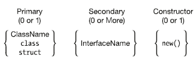

## Learn C# Generics

##### Type constraints

	class MyClass<T, U, V>
			where T: Customer, IEntity
			where U: IComparable {
	}

*no separators between where clauses*

##### Constraint Types and order
|Constrint Type	  |Description   |
|---|---|
|*ClassName*   |Only classes of this type or classes drived from it   |
|`class`   |Any refernce type (e.g *classes, arrays, delegates, interfaces*)   |
|`struct`   |Any value type   |
|*InterfaceName* |Only this interface or types that implement this interface|
|`new()`|Any type with a parameterless public constructor|

*if any parameter has multiple constraints, they must be in this order*